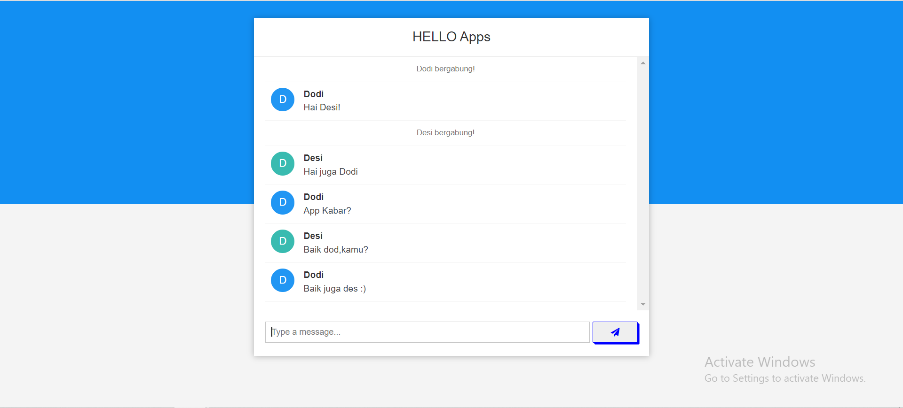

# HELLO-Apps---Backend-Test-Rakamin
Chat Application using SpringBoot - WebSocket



## Requirements

1. Java 11
2. Maven 3.8.4 atau lebih

## Langkah-langkah Melalukan Setup

**1. Melakukan Git Clone**
```bash
https://github.com/RachelGultom2000/HELLO-Apps---Backend-Test-Rakamin.git
```

**2. Build dan Run Menggunakan Maven** <br>
Supaya lebih mudah,cukup jalankan seperti ini pada terminal
```bash
mvn spring-boot:run
```
**Cara membuka terminal**
1. Klik kanan pada root folder
2. Lalu pilih Show Local in Terminal
3. Kemudian pilih terminal dan jalankan perintah diatas

**Aplikasi secara default akan berjalan di Port 8080 dengan url http://localhost:8080/**
